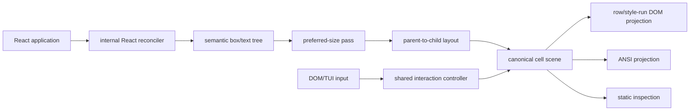

# faux-ui architecture

## Status

This document describes the implemented 0.9.1 evidence-candidate architecture. Historical prototype analysis is in the [TUI-first reset dossier](refactors/2026-07-31-tui-first-reset/README.md); the current plural layout API and focused naming changes are recorded in the implemented [API language review](refactors/2026-08-01-api-language-review/README.md).

## System shape

One publishable package contains internal semantic modules and isolated public host entrypoints.



There is no generic renderer SDK, environment-detecting facade, schema layer, runtime bridge, or duplicated host interaction engine.

## Repository boundaries

```text
packages/ui/
  src/
    index.ts                 public components, hooks, and types
    dom.ts                   browser-only entry
    tui.ts                   Node/terminal-only entry
    testing.ts               static inspection entry
    jsx-runtime.ts           restricted JSX namespace
    jsx-dev-runtime.ts
    components.ts            public component compositions
    runtime.ts               renderer-neutral input/focus hooks
    internal/
      model.ts               semantic nodes and public value types
      reconciler.ts          React-to-semantic-tree mutation bridge
      layout.ts              preferred and exact layout passes
      unicode-data.ts        generated Unicode 17 tables
      unicode.ts             grapheme segmentation/cellization
      controller.ts          focus/key/pointer/press/scroll state
      scene.ts               canonical painting and row runs
      dom-scene.ts           DOM projection primitives
      ansi.ts                true-color ANSI projection
      tui-input.ts           terminal protocol parsing
      mount.ts               end-to-end semantic mount lifecycle
apps/example/                serious queue/detail/metadata fixture
scripts/
  generate-unicode-data.mjs  reproducible Unicode table generator
  test-package.mjs           packed external-consumer gate
```

Only `@faux-ui/ui` is installed by app authors. Internal file boundaries preserve separation of concerns without publishing each concern as a package.

## Public entrypoint isolation

### `@faux-ui/ui`

Exports renderer-neutral components, hooks, geometry/layout/event/theme types, and the package version. `Rows` compiles to the internal vertical axis; `Columns` compiles to the internal horizontal axis. It imports no DOM or Node host.

### `@faux-ui/ui/dom`

Exports browser `render()` and DOM option/handle types. Its dependency graph contains no Node or TUI module.

### `@faux-ui/ui/tui`

Exports terminal `render()`, fakeable stream interfaces, and TUI option/handle types. Node terminal imports exist only below this subpath.

### `@faux-ui/ui/testing`

Exports `renderStatic()`, logical scene/layout inspection, text snapshots, event traces, row runs, and Unicode metadata.

### JSX runtimes

The package forwards React's JSX functions but exposes an empty intrinsic-element namespace. Apps compose exported React components; HTML/SVG and internal `faux-box`/`faux-text` tags are rejected by TypeScript.

## React reconciliation

The internal custom reconciler supports two host instances:

- `faux-box` → `BoxNode`;
- `faux-text` → `TextNode`.

Public components create those host instances with `React.createElement`; their tag names are not public JSX.

Reconciler rules:

- one semantic root per mounted app;
- raw strings/numbers only under `Text`;
- boxes contain semantic nodes;
- direct function handlers only;
- instance IDs remain stable across ordinary React updates;
- derived layout/paint state is never stored on semantic nodes;
- React commits trigger one semantic recomputation.

`useState`, effects, contexts, and ordinary component composition remain React-owned.

## Semantic model

### Text node

Contains:

- explicit string content;
- clip/ellipsis mode;
- horizontal/vertical alignment;
- semantic style and focus/hover overlays;
- direct handlers and optional accessibility label;
- an internal fill flag used by `Fill`/`Divider`.

### Box node

Contains:

- source-ordered children;
- no axis, row, or column axis;
- fixed/auto/fraction tracks;
- integer gap and normalized padding;
- optional four-edge border/title;
- semantic style and interaction overlays;
- optional scroll axis;
- focusability/disabled state and direct handlers.

Parent/child pointers support ancestry dispatch. Nodes contain no layout cache, dirty flags, renderer handles, or host objects.

## Unicode cellization

Runtime Unicode behavior has no third-party dependency.

`scripts/generate-unicode-data.mjs` downloads the pinned Unicode 17.0.0 Character Database and generates compact lookup tables for:

- grapheme-break properties;
- Indic conjunct properties;
- extended pictographic and emoji-presentation properties;
- East Asian wide/fullwidth ranges.

`unicode.ts` implements UAX #29 extended grapheme boundaries and terminal cell policy. The complete official Unicode 17 grapheme conformance fixture runs in tests.

Cellization produces width-1/width-2 graphemes. Scene painting creates an explicit continuation cell for width-2 output. Ambiguous characters are narrow, tabs use four-cell stops, controls become `�`, and leading combining clusters receive a dotted-circle base.

A Unicode table change is observable semantic behavior and requires regenerated data plus updated tests.

## Layout

Layout is recomputed as pure derived output from the semantic tree and explicit root size.

### Pass 1: preferred sizes

- Text measures newline-delimited lines through the shared cellizer.
- Sequential boxes combine child preferred sizes, fixed tracks, gaps, padding, and borders.
- Fraction tracks behave as auto only in this pass.
- Scroll content can retain preferred extent beyond its viewport.

The result is an immutable `PreferredNode` tree.

### Pass 2: exact allocation

The root always receives `{x: 0, y: 0, width, height}`.

For each box:

1. reserve border and padding;
2. subtract gap cost;
3. resolve fixed tracks;
4. resolve auto tracks from preferred sizes;
5. divide positive remainder among fractions;
6. floor proportional shares and distribute remainder from first to last;
7. allocate exact source-ordered child frames;
8. intersect descendant clips with the content viewport.

Fixed/auto overflow is retained geometrically and clipped. There is no sibling renegotiation or second child-layout pass.

The resulting `LayoutNode` tree contains absolute frames, clips, content frames, content extents, and children. Scroll offsets are absent from layout.

## Shared interaction controller

One `InteractionController` owns:

- focused node;
- hover ancestry;
- active pointer press;
- per-scroll-box offsets;
- normalized event traces.

Hosts send normalized commands. The controller performs target-to-root dispatch, focus traversal, Enter/Space/pointer activation, hover transitions, and scroll clamping.

Key behavior:

- app-level `useInput` handlers run before semantic key dispatch;
- Tab/Shift+Tab traverse visible focusable nodes;
- one physical activation emits one `press`;
- pointer points are already logical cells;
- wheel, SGR mouse, arrows, Page Up/Down, Home, and End share offsets;
- disappearing focused/hovered nodes are reconciled on the next commit;
- handlers can prevent default behavior or stop propagation.

Controller changes repaint the same scene regardless of host.

## Canonical scene

`paintScene()` creates a row-major `width × height` cell array. Each cell contains:

- final grapheme or blank;
- continuation marker;
- resolved semantic style;
- owning semantic node ID.

Paint order is:

1. default surface;
2. box backgrounds/ownership;
3. borders and titles;
4. text/fill content;
5. focus/hover style overlays selected before node paint.

Nested scroll offsets translate painting, not layout. Every write checks the active clip. A width-2 grapheme is omitted if both cells cannot be written, preventing half glyphs.

Scene ownership drives host-independent hit testing. `sceneRows()` groups adjacent equal-style cells into runs; owner changes do not force visual DOM fragmentation.

## Mount lifecycle

`SemanticMount` connects reconciliation, layout, controller, and scene:

1. wrap the app in the internal input/focus context;
2. commit one semantic root;
3. compute preferred/layout output for the current explicit size;
4. reconcile controller state;
5. paint the canonical scene;
6. notify host frame subscribers.

React commits, controller changes, and size changes all enter the same recomputation path. Re-entrancy is coalesced. No cache exists before profiling demonstrates a need.

## DOM host

The browser host creates one application surface and two internal layers:

- a visual row/style-run layer marked `aria-hidden`;
- a clipped accessibility layer with one semantic node per labeled action.

The root is one focusable `role="application"` element. Shared focus updates `aria-activedescendant`; native focus never becomes semantic state.

The host uses inline-owned styles, disabled ligatures, fixed physical cell calibration, and no app CSS. Each scene row becomes a positioned row and each style run a positioned span. Ordinary text keeps the default monospace stack; Unicode box-drawing, block, legacy-computing, and Powerline ranges are split into terminal-graphics runs that prefer connection-safe fonts without horizontal endpoint overhang. Those runs use zero letter spacing and whole-run horizontal fitting; normal text keeps its independently calibrated spacing. The projector fits residual runs to their canonical width and slightly overlaps adjacent backgrounds. Glyph height is never stretched and no geometric border overlay or per-cell DOM projection exists.

Mouse-wheel line/page events and conventional large pixel notches become one logical cell step, matching one terminal wheel command. Small pixel deltas accumulate to a cell so trackpads remain smooth without skipping short scroll content.

Pointer conversion uses the actual surface rectangle and logical scene dimensions:

```text
cellX = floor((clientX - rect.left) * logicalWidth / rect.width)
cellY = floor((clientY - rect.top)  * logicalHeight / rect.height)
```

Default body mounting resets margin/overflow and derives bounds from the viewport at 8×16 pixels per cell. Custom containers can fit their content box; explicit width/height bypass fitting. Resizing resolves a new explicit size before semantic layout.

Unmount removes listeners/observers/surface and restores host inline styles. Failed initial renders follow the same cleanup path.

## TUI host

The terminal entry owns all Node-specific behavior:

- terminal column/row sizing;
- raw mode;
- alternate screen and cursor visibility;
- SGR mouse negotiation/parsing;
- key/CSI parsing;
- true-color ANSI serialization;
- full-frame redraw and resize;
- lifecycle restoration.

Input/output are structural interfaces, enabling fake streams without a real terminal. Full-frame painting disables terminal autowrap and uses explicit CRLF row boundaries, so writing the final terminal column cannot insert or shift rows. After each non-ASCII grapheme, ANSI horizontal positioning re-anchors subsequent cells; a terminal that assigns a different width to an emoji, combining, ambiguous, or CJK sequence therefore cannot move later borders. Ctrl+C can unmount or route as a shared key. Cleanup restores autowrap and is idempotent.

## Palette

Semantic scenes store palette names, not concrete colors. `ThemeProvider` supplies one concrete `#RRGGBB` mapping used by both hosts. DOM converts names to CSS colors; TUI converts the same values to ANSI true color.

## Verification architecture

The release gate combines:

- TypeScript 7 project and test typechecking;
- unit tests for Unicode, layout, scene, controller, React, DOM sizing, ANSI, TUI parsing/lifecycle;
- 1,000 randomized layout property runs;
- all official Unicode 17 grapheme boundary cases;
- real-Chromium DOM projection/input/resize/accessibility tests;
- serious queue/detail/metadata fixture tests;
- packed tarball clean install;
- consumer JSX/typecheck;
- Bun and Vite browser bundles checked for Node/TUI leakage;
- fake-terminal execution from the packed artifact;
- production package/example builds.

The package has one required runtime dependency, `react-reconciler`; `scheduler` is its transitive dependency and React is a peer. Unicode/layout/scene/controller/host behavior adds no runtime package dependency.
