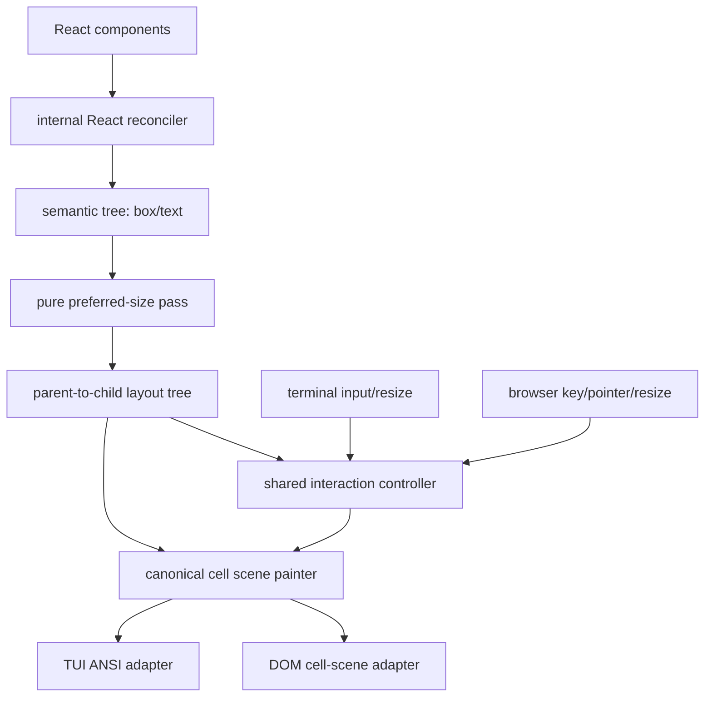

# faux-ui refactor report

## Outcome

The recommendation in this historical report is implemented by the 1.0.0 source tree. The repository now has one public package, isolated host subpaths, pure one-axis layout, vendored Unicode 17 cellization, one canonical scene/controller, the foundation components, packed consumer gates, and no prototype compatibility packages. See [../architecture.md](../architecture.md) for implemented reality and [tasks.md](tasks.md) for the completed execution record.

## Executive recommendation

Reset faux-ui around one narrow product promise:

> Build React-authored, terminal-first tool interfaces on an explicit character-cell grid, then project the exact same logical frame and interactions into the browser.

Keep the successful ideas—React authoring, integer cells, semantic colors, deterministic tracks, shared clipping/hit testing—and remove the speculative ecosystem around them.

The recommended reset is:

1. **One public package:** `@faux-ui/ui`.
2. **Target-specific entrypoints:** `@faux-ui/ui/tui` and `@faux-ui/ui/dom`; never auto-import both hosts.
3. **One canonical cell scene:** shared layout and painting decide glyphs, styles, clipping, borders, and node ownership before either renderer runs.
4. **One interaction controller:** focus, key routing, press activation, hover, pointer, and scroll semantics are shared; hosts only translate input.
5. **A smaller layout model:** nested one-axis rows/columns, fixed/content/fraction tracks, fixed-cell gap/padding/border, sequential placement, and no general grid negotiation.
6. **A small complete authoring kit:** `Box`, `Row`, `Column`, `Text`, `Fill`/`Divider`, `ScrollView`, and `Button`, plus renderer-neutral key/focus hooks. Add richer inputs only after this set proves insufficient.
7. **Delete premature surfaces:** generic renderer SDK, inspect renderer package, canvas renderer example, compact schema, placeholder MCP/devtools packages, and current scaffold/exec CLIs. Reintroduce tooling only on top of a stable public contract.

No compatibility layer or migration path is needed. `g-calendar-cleanup` is evidence, not a supported consumer.

## Why a reset is justified

### The core product idea worked

The one real external app confirms that fixed-cell React UI is useful for keyboard-first tools. It was possible to build a meaningful browser UI without app CSS, and rows/columns plus semantic colors were easy for an agent to reason about.

### The last mile did not work

The same app had to:

- vendor the whole monorepo;
- build faux-ui separately;
- avoid `@faux-ui/app` because its browser bundle imports TUI/Node code;
- import the DOM renderer directly;
- manually wire a UI/runtime bridge for scrolling;
- build compact action chips, spacing, tones, and global hotkeys from raw nodes.

This is exactly the wrong distribution of complexity: framework internals are broad, while the app-facing path is incomplete.

### The implementation is broad before release

Current package source is roughly:

- core: 2,090 lines;
- React/public orchestration: 2,327 lines;
- renderer implementations: 4,799 lines;
- schema/tooling/scaffolding: 2,761 lines.

There are 13 packages and 3 apps, but only one external use case. PR #1 added 16,191 lines and PR #2 added 4,527 more. The history repeatedly says “simplify,” while implementation adds adapters around prior adapters.

## Product scope

### Primary users

- humans and coding agents building local/internal tools;
- keyboard-first review, triage, dashboard, inspector, log, and operations interfaces;
- applications that benefit from deterministic source-visible layout;
- applications that may run in a terminal, browser, or both.

### Product promise

- familiar React state and components;
- no app CSS required for a usable default;
- one explicit cell coordinate system;
- same logical text, borders, clipping, focus, activation, and scrolling in TUI and DOM;
- one small import surface with no renderer internals exposed;
- inspectable deterministic output suitable for tests and agents.

### Explicit non-goals for the first release

- a browser design system;
- CSS/Flexbox/Grid compatibility;
- automatic base-text wrapping;
- general two-dimensional grid placement, named tracks, spans, or min/max negotiation;
- arbitrary third-party renderer SDK;
- serialized compact UI protocol;
- MCP/editor ecosystem before the app API is stable;
- compatibility with the current prototype packages.

## Target architecture



### Semantic tree

Use only two internal node kinds:

- `box`: rectangular container, optional one-axis child layout, chrome, style, scrolling, focus, and handlers;
- `text`: explicit newline-delimited text with deterministic overflow behavior.

Public components such as `Row`, `Column`, `Button`, and `ScrollView` compile to those nodes.

### Layout

Replace recursive constraint negotiation with two explicit phases:

1. **Preferred-size pass:** text is cellized; boxes combine child preferred sizes with fixed tracks, gap, padding, and border.
2. **Layout pass:** the root provides one explicit integer rectangle and each parent allocates exact child rectangles top-down.

Recommended rules:

- `Row` and `Column` only; complex layouts use nesting.
- Child placement is sequential.
- Tracks are non-negative integers, `auto`, or positive `Nfr` values.
- Fixed and `auto` tracks resolve first; fractions split positive remainder deterministically.
- Overflow is clipped, not renegotiated.
- Gap, padding, and border are integer cell costs.
- Every child receives an allocated frame; its content aligns within that frame.
- Scroll layout may extend the content rectangle on its scroll axis, but the viewport remains explicit.

This removes named placement, two-axis cell occupancy, accidental stretch behavior, and repeated unconstrained/bounded layout calls.

### Root sizing

The semantic engine must always receive explicit integer width and height. That does not have to mean boilerplate for every app:

- TUI derives the concrete size from terminal columns/rows by default.
- DOM may derive a concrete size from its container and one host-level cell calibration.
- static rendering/tests pass size explicitly;
- an explicit size always overrides host fitting.

No child text or browser flow participates in root or nested sizing.

### Canonical cell scene

Move framebuffer/cell output out of the TUI package and make it shared. A scene cell should carry at least:

- grapheme or continuation marker;
- foreground/background semantic style;
- owning semantic node ID for inspection/hit testing.

Borders, dividers, scrollbars, clipping, hover/focus styles, and text overflow are painted once into this scene. TUI serializes it to ANSI. DOM groups scene cells into row/style runs and renders them in a monospace application surface.

This solves the current arbitrary 256/512 divider fills and makes DOM/TUI glyph parity testable by construction.

### Unicode policy

Do not use UTF-16 `string.length` as cell width. Freeze a modest policy:

- explicit `\n` creates lines; base text never auto-wraps;
- segment with pinned Unicode data, not host-dependent guesses;
- assign each grapheme a deterministic width of 0, 1, or 2 cells;
- ambiguous-width characters use width 1;
- combining clusters attach to a leading cell;
- wide glyphs reserve a continuation cell;
- control/tab behavior is explicit;
- DOM and TUI consume the same cellized lines.

The exact pinned Unicode version/library is a short implementation decision gate, not a renderer choice.

### Interaction controller

Factor host-neutral state and dispatch out of both runtimes:

- focused node and tree-order focus traversal;
- root-level key routing even when no child is focused;
- unified `press` synthesis from Enter, Space, and pointer click;
- hover path and optional pointer lifecycle;
- scroll target selection and offset clamping;
- lifecycle cleanup when nodes disappear;
- deterministic bubbling with a stop mechanism.

DOM should use one application focus surface rather than browser focus as semantic truth. Terminal and browser adapters emit the same controller commands and can be contract-tested with identical event traces.

### DOM adapter

The DOM is a browser display/input adapter, not a semantic element tree.

- Importing `/dom` must not load Node/TUI code.
- The renderer installs its own minimal reset/default styles; no app CSS is required.
- It renders cell rows/style runs from the canonical scene.
- Pointer pixels are converted to logical cells using the rendered surface dimensions/cell calibration.
- Resize produces a new explicit root size before layout.
- Theme values map to the same palette used by TUI.
- Accessibility needs a deliberate minimal contract (application label, focus state, action labels); do not accidentally inherit inconsistent semantics from hundreds of nested divs.

### TUI adapter

- Resolve terminal size and resize into explicit engine sizes.
- Convert host input sequences into shared controller commands.
- Serialize the shared scene to ANSI with the active palette.
- Keep alternate-screen/raw-mode/mouse support host-specific.
- Reuse current terminal parsing only after removing interaction semantics from it.

## Public package and API

Recommended package exports:

```json
{
  ".": "components, hooks, types and JSX runtime",
  "./dom": "browser render entry",
  "./tui": "terminal render entry",
  "./testing": "frame, tree and event inspection helpers",
  "./jsx-runtime": "React JSX runtime",
  "./jsx-dev-runtime": "React JSX development runtime"
}
```

Typical dual-host app:

```tsx
// App.tsx
import {
  Box,
  Button,
  Column,
  Row,
  ScrollView,
  Text,
} from "@faux-ui/ui";

export function App() {
  return (
    <Column tracks={[3, "1fr", 1]} onKeyDown={handleShortcut}>
      <Box border="single" paddingX={1}>
        <Text overflow="ellipsis-end">Review queue</Text>
      </Box>
      <Row tracks={[30, "2fr", "3fr"]} gap={1}>
        <Box border="single" title="Queue" />
        <ScrollView axis="y">
          <Box border="single" title="Item" />
        </ScrollView>
        <Box border="single" title="Details" />
      </Row>
      <Button tone="danger" hotkey="W" onPress={removeItem}>
        Delete
      </Button>
    </Column>
  );
}
```

```tsx
// main.dom.tsx
import { render } from "@faux-ui/ui/dom";
import { App } from "./App.js";

render(<App />, { fit: "viewport" });
```

```tsx
// main.tui.tsx
import { render } from "@faux-ui/ui/tui";
import { App } from "./App.js";

render(<App />);
```

The exact prop names should be validated in a small vertical slice, but the package shape and separation should not change.

## Minimum indispensable building blocks

### Release foundation

- `Text`: explicit lines, semantic style, clip and deterministic ellipsis modes.
- `Box`: background/color, fixed-cell padding, border/title, content alignment, handlers.
- `Row` / `Column`: sequential fixed/auto/fraction allocation and gap.
- `Fill` plus a thin `Divider` convenience: paint a repeated glyph using the allocated frame, not guessed lengths.
- `ScrollView`: managed offset, clipping, keyboard/wheel support, optional scene-painted scrollbar.
- `Button`: one activation contract across pointer/keyboard, semantic tones, disabled/selected state, compact padding, hotkey label.
- root key/input handling and focus traversal.
- one shared palette/theme contract.

### Build on top as recipes first

- app shell;
- panel/card (mostly `Box` with border/title);
- action bar/toolbar;
- split/sidebar/inspector layouts;
- loading/error/empty states;
- status/stat cards;
- key-hint strip;
- selectable list composed from buttons/rows.

Promote a recipe only after at least two real applications repeat it.

### Deliberately later

- text input/editor and caret/selection semantics;
- checkbox/toggle if `Button` state is insufficient;
- list virtualization;
- tables, tabs, trees, charts;
- opt-in wrapping helper requiring an explicit width;
- JSON schema and action-name adapter;
- CLI/MCP integrations;
- third-party renderer API.

## What to reuse, rewrite, and delete

### Reuse as behavior/reference

- track rounding invariants in `resolveTracks()`;
- render-tree clipping and hit-test concepts;
- semantic palette names/defaults;
- React reconciler host restrictions and direct handlers;
- framebuffer ANSI style serialization;
- terminal input parsing and host lifecycle;
- existing behavior tests where they match the new spec.

### Rewrite

- layout tree and preferred-size calculation;
- mutable layout/cache model;
- shared scene/framebuffer;
- interaction state machine;
- DOM projection and pixel-to-cell mapping;
- TUI palette path;
- public components and render entrypoints;
- examples and package smoke tests.

### Delete without shims

- `@faux-ui/app`;
- `@faux-ui/renderer`;
- `@faux-ui/render-inspect`;
- contributor canvas renderer app and renderer scaffold;
- UI runtime bridge/provider;
- dead DOM/TUI text measurers and `wrap` fields;
- named tracks and explicit row/column placement;
- string action tokens in JSX/core;
- compact schema codec and duplicated schema types;
- placeholder MCP/devtools packages;
- current create/exec CLIs until the package contract stabilizes;
- tracked test/log artifacts.

## Testing strategy

The primary invariant is logical parity, not similar screenshots.

1. **Layout unit/property tests:** exact frames, overflow, gap/padding/border costs, fraction rounding, scroll content extent.
2. **Cellization tests:** ASCII, box drawing, combining marks, emoji/wide glyphs, truncation, explicit newlines.
3. **Golden scene tests:** glyph/style/node-owner matrices.
4. **Cross-host contract tests:** feed identical controller commands and compare focus, offsets, handler order, and final scene.
5. **DOM browser tests:** real pixel-to-cell conversion, resize, keyboard, pointer, no body-margin overflow, and scene-to-DOM text/style runs.
6. **TUI tests:** ANSI output, resize, raw-mode cleanup, terminal input parsing.
7. **Public type tests:** only intended components/entrypoints are reachable.
8. **Package smoke test:** pack/install into a clean fixture, typecheck, Bun-browser bundle `/dom`, and execute `/tui` with fake IO.
9. **Real-tool fixture:** a queue/detail/metadata/action-bar screen modeled after the consumer, implemented only with public APIs and no CSS/runtime bridge.

All tests must be included in a typecheck lane; transpile-only success is insufficient.

## Success criteria for the reset

- One published package and no required internal-package knowledge.
- Browser entry bundles with Bun and Vite without Node/TUI warnings or code.
- A DOM app mounts in one call; a TUI app mounts in one call.
- No app CSS is required for a full-viewport default.
- No runtime bridge, node-ID ref, arbitrary divider fill count, or manual renderer adapter appears in app code.
- DOM and TUI expose the same canonical scene for a given tree, size, theme, and interaction state.
- Root size is concrete before layout; child/font measurement never drives semantic layout.
- Global shortcuts work through shared semantics on both hosts.
- The real-tool fixture uses the public component set without raw internal nodes.
- Tests and generated fixtures are typechecked and package-consumer tested.

## Risks and mitigations

- **Unicode parity is difficult.** Freeze a limited versioned policy and test logical cells; do not promise every terminal/font renders every grapheme identically.
- **A cell-scene DOM may reduce native accessibility.** Define a small explicit accessibility layer and keep browser-style forms out of the initial scope.
- **Removing caches could regress large trees.** Prefer correctness and profile the real-tool fixture; add caches only around measured bottlenecks.
- **No automatic wrap can harm prose usability.** Ship ellipsis and explicit multiline composition first; add width-explicit wrapping only from evidence.
- **Destructive package collapse creates a large diff.** Build a thin end-to-end vertical slice first, then delete old packages immediately once parity gates pass.

## Decision

Proceed with a clean vNext implementation rather than incrementally wrapping the current package graph. The old implementation remains valuable as a test/reference library, but preserving its API would preserve the exact complexity the reset is intended to remove.
